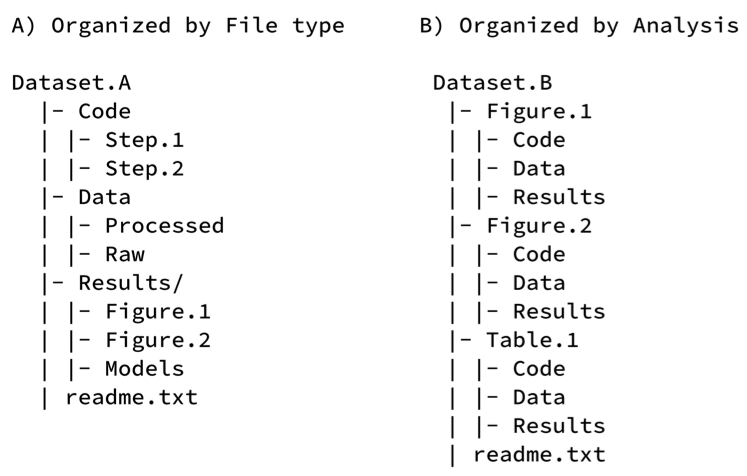

# Directory Structure 

A clear directory structure will make it easier to locate files and versions and this is particularly important when collaborating with others. Consider a hierarchical file structure starting from broad topics to more specific ones nested inside, restricting the level of folders to 3 or 4 with a limited number of items inside each of them. 
Examples:
- The UK data services offers an example of directory structure and naming: https://ukdataservice.ac.uk/manage-data/format/organising.aspx 
- Dryad Best Practices: https://datadryad.org/stash/best_practices 

